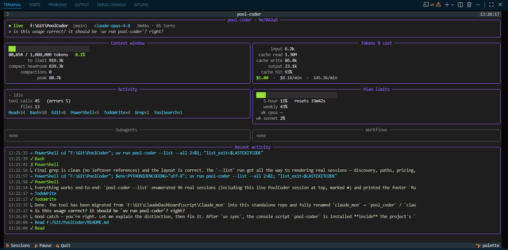
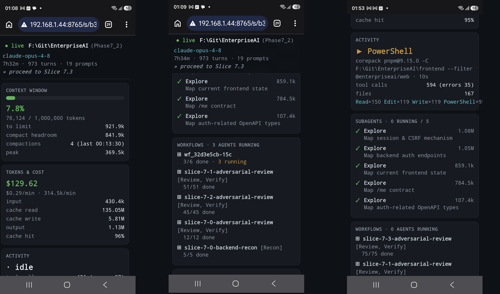

# pool-coder

Realtime terminal/web dashboard for **Claude Code** sessions running on your local computer. It tails the session  
transcript under `~/.claude/projects/<project-hash>/<session-id>.jsonl` (plus
its subagent and workflow sidecars) **read-only** and shows live context size,
token spend & cost, running subagents, workflow progress, and your plan limits.

It never locks the file Claude Code is writing: it only ever opens files
read-only and reads appended bytes by offset. (CPython's default `open` on
Windows shares read+write+delete, verified on this machine.)
Especially usaful with ultracode sessions.



Web UI On Modile:




## Install / run

Requires [uv](https://docs.astral.sh/uv/) and Python ≥ 3.12.

```sh
uv sync                      # create the venv and install pool-coder
uv run pool-coder            # interactive picker -> live dashboard
uv run pool-coder --serve      # serve the dashboard over HTTP (open on your phone)
```

## Usage

> Run commands with `uv run pool-coder …` from the repo. Or activate the venv
> once (`source .venv/bin/activate`, or `.venv\Scripts\Activate.ps1` on Windows)
> and drop the prefix — just `pool-coder …`.

```sh
uv run pool-coder              # pick a session (↑/↓ + Enter), then monitor it (terminal)
uv run pool-coder --serve      # serve the dashboard over HTTP (open on your phone)
```

other options

```sh
uv run pool-coder --session <id>   # monitor a session directly
uv run pool-coder --list           # list active sessions and exit
uv run pool-coder --once           # print one text snapshot and exit (headless)
uv run pool-coder --once --json    # one snapshot as JSON (scriptable)
```

Options: `--all` (include idle sessions), `--no-plan-limits` (skip the OAuth
panel), `--window opus=200000` (override a context-window size, repeatable),
`--pricing path/to/pricing.toml` (override cost rates). For `--serve`:
`--port 8765`, `--host 0.0.0.0`.

### On your phone / browser

```sh
uv run pool-coder --serve     # prints a phone URL like http://192.168.1.x:8765/
```

Open that URL on any device on the **same Wi-Fi**. You get a responsive HTML
dashboard (same metrics as the TUI) that auto-refreshes: `/` lists active
sessions, tap one to monitor it, and there's a JSON feed at `/api/s/<id>`.
Pin a single session with `--session <id>`. It's **read-only and
unauthenticated** — only expose it on a network you trust (use
`--host 127.0.0.1` to keep it local).

**Dashboard keys:** `b` back to sessions · `p` pause · `q` quit.
**Picker keys:** `↑/↓` move · `Enter` open · `a` all/active · `r` reload.

## What it shows

| Panel | Metrics |
|-------|---------|
| **Context window** | current tokens (`input + cache_read + cache_write`) vs limit, occupancy % gauge, tokens-to-limit, headroom to auto-compact, compaction events |
| **Tokens & cost** | cumulative input/cache/output tokens, cache-hit ratio, **estimated $ cost**, cost/min, per-model breakdown, web search/fetch counts |
| **Activity** | what Claude is doing *now* (in-flight tool), tool-call counts by name, errors, files touched |
| **Subagents** | each subagent's type, description, running/done, turns, in-flight tools, token total |
| **Workflows** | per workflow: name, phases, agents started/running/done (from the journal) |
| **Plan limits** | 5-hour window % + reset countdown, weekly / weekly-Opus / weekly-Sonnet % (via the OAuth usage endpoint) |
| **Recent activity** | live play-by-play: Claude's text replies (`↳`), thinking (`✎`), your prompts (`»`), tool calls/results (`→`/`✓`/`✗`, with the active TodoWrite item), compactions (`⟳`), and subagent/workflow lifecycle |

## Configuration

- **Context window** — Opus can be 200K or 1M and the JSONL `model` field can't
  tell them apart, so it defaults to **1M** (auto-detected up to 1M once context
  exceeds 200K). Override with `--window opus=200000`.
- **Pricing** — edit [`pricing.toml`](./pricing.toml) (USD per 1M tokens, per
  model family) and pass it with `--pricing`. Cost is an estimate.
- **Plan limits** — reads `~/.claude/.credentials.json` and polls the usage
  endpoint every 5 min. Shows "unavailable" if credentials are missing/expired.
  Set `POOL_CODER_CREDENTIALS` to point elsewhere.

## Architecture

A decoupled core feeds an immutable snapshot to the UI:

```
discovery ─┐
tailer ────┤→ aggregator → SessionState ─(reader thread)→ Snapshot ─→ Textual UI
plan-limits┘                                                   ▲ get_snapshot()
```

- **tailer** — read-only byte-offset reader; handles partial lines, UTF-8 splits
  across reads, truncation/rotation, and huge-file catch-up.
- **discovery** — glob-diffs the four sidecar patterns, attaching a tailer per
  new subagent/workflow file; excludes `tool-results/` and `memory/`.
- **aggregator** — replay-safe left-fold of the record stream into live state.
- **engine** — owns it all on one reader thread; publishes immutable snapshots.
- **sources** — pluggable. v1: `jsonl_source`, `plan_limits`. *Phase 2 adds
  Prometheus + Tempo sources behind the same seam.*

The headless `--once --json` path imports nothing from the UI — the acceptance
test for the core/UI split.

## Develop

```sh
uv run pytest          # tailer, aggregator, discovery, pricing, render
```
