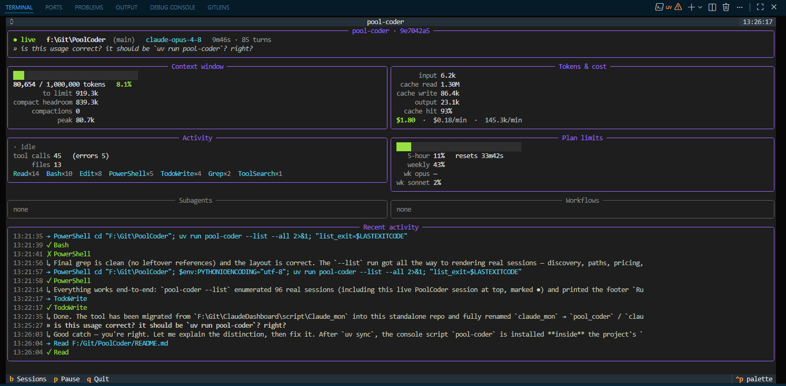
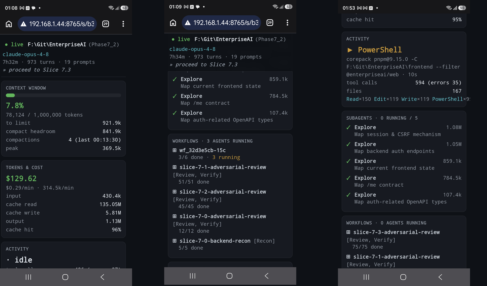

# pool-coder

Realtime terminal/web dashboard for **Claude Code** or **OpenAI Codex**
sessions (CLI, VS Code extension, Desktop) running on your local computer. It
tails the session transcript **read-only** — for Claude Code
`~/.claude/projects/<project-hash>/<session-id>.jsonl` plus its subagent and
workflow sidecars, for Codex the thread's rollout under `~/.codex/sessions/`
plus its sub-agent threads (see [Codex](#codex)) — and shows live context size,
token spend & cost, running subagents, workflow progress, and your plan limits.

It never locks the file the agent is writing: it only ever opens files
read-only and reads appended bytes by offset. (CPython's default `open` on
Windows shares read+write+delete, verified on this machine.)
Especially useful with ultracode sessions.



Web UI on mobile:




## Install / run

Requires [uv](https://docs.astral.sh/uv/) and Python ≥ 3.12.

```sh
uv sync                      # create the venv and install pool-coder
uv run pool-coder            # interactive picker -> live dashboard
uv run pool-coder --codex    # the same for OpenAI Codex sessions
uv run pool-coder --serve    # serve the dashboard over HTTP (open on your phone)
```

## Usage

> Run commands with `uv run pool-coder …` from the repo. Or activate the venv
> once (`source .venv/bin/activate`, or `.venv\Scripts\Activate.ps1` on Windows)
> and drop the prefix — just `pool-coder …`.

```sh
uv run pool-coder              # pick a session (↑/↓ + Enter), then monitor it (terminal)
uv run pool-coder --serve      # serve the dashboard over HTTP (open on your phone)
```

other options

```sh
uv run pool-coder --session <id>   # monitor a session directly
uv run pool-coder --list           # list active sessions and exit
uv run pool-coder --once           # print one text snapshot and exit (headless)
uv run pool-coder --once --json    # one snapshot as JSON (scriptable)
```

For **Codex** sessions add `--codex` (short for `--agent codex`; the default is
`--agent claude`) to any mode:

```sh
uv run pool-coder --codex                        # pick a Codex session, then monitor it
uv run pool-coder --codex --serve                # Codex dashboard over HTTP
uv run pool-coder --codex --session <thread-id>  # monitor a Codex thread directly
uv run pool-coder --codex --list                 # list active Codex sessions and exit
uv run pool-coder --codex --once                 # one text snapshot (headless)
uv run pool-coder --agent codex --once --json    # one snapshot as JSON
```

Options: `--all` (include idle sessions), `--no-plan-limits` (skip the plan
limits panel), `--window opus=200000` (override a context-window size,
repeatable; for Codex `gpt=N` is only a fallback, see
[Configuration](#configuration)), `--pricing path/to/pricing.toml` (override
cost rates). For
`--serve`: `--port 8765`, `--host 0.0.0.0`.

### On your phone / browser

```sh
uv run pool-coder --serve     # prints a phone URL like http://192.168.1.x:8765/
```

Open that URL on any device on the **same Wi-Fi**. You get a responsive HTML
dashboard (same metrics as the TUI) that auto-refreshes: `/` lists active
sessions (Codex ones with `--codex`), tap one to monitor it, and there's a JSON
feed at `/api/s/<id>`. Pin a single session with `--session <id>`. It's
**read-only and unauthenticated** — only expose it on a network you trust (use
`--host 127.0.0.1` to keep it local).

**Dashboard keys:** `b` back to sessions · `p` pause · `q` quit.
**Picker keys:** `↑/↓` move · `Enter` open · `a` all/active · `r` reload.

## What it shows

| Panel | Metrics |
|-------|---------|
| **Context window** | current tokens (`input + cache_read + cache_write`) vs limit, occupancy % gauge, tokens-to-limit, headroom to auto-compact, compaction events |
| **Tokens & cost** | cumulative input/cache/output tokens, cache-hit ratio, **estimated $ cost**, cost/min, per-model breakdown, web search/fetch counts |
| **Activity** | what the agent is doing *now* (in-flight tool), tool-call counts by name, errors, files touched |
| **Subagents** | each subagent's type, description, running/done, turns, in-flight tools, token total |
| **Workflows** | per workflow: name, phases, agents started/running/done (from the journal; Claude Code only) |
| **Plan limits** | 5-hour window % + reset countdown, weekly / weekly-Opus / weekly-Sonnet % (via the OAuth usage endpoint); for Codex, see [below](#codex) |
| **Recent activity** | live play-by-play: the agent's text replies (`↳`), thinking (`✎`), your prompts (`»`), tool calls/results (`→`/`✓`/`✗`, with the active TodoWrite item), compactions (`⟳`), and subagent/workflow lifecycle |

## Codex

`--codex` gives OpenAI Codex threads the same dashboard. What differs:

- **Files read** — only `$CODEX_HOME` (default `~/.codex`):
  `sessions/YYYY/MM/DD/rollout-<time>-<thread-id>.jsonl` (one file per
  thread) and `session_index.jsonl` (thread names). The list, picker and web
  list read only the last 256 KB of each rollout; when no prompt is found
  there (common on long agentic threads) the LAST column shows the thread's
  name in brackets, e.g. `[Plan improved Markdown editor]`, instead of its
  last prompt. Everything is opened read-only, there are no
  network calls, and `auth.json` is never touched. Not supported yet:
  compressed `.jsonl.zst` rollouts (Codex compresses files idle for 7 days) and
  `archived_sessions/`.
- **Activity time** — the list order, the 30-minute "active" filter and the
  `● live` badge use the later of the file's mtime and its last record's
  timestamp, because on Windows a growing rollout's mtime can lag it by hours.
  (A file touched or rewritten in place can therefore look live in the list
  while its dashboard, which goes by record times, says idle.)
- **Sub-agents** — sub-agent and guardian (auto-review) threads are separate
  rollouts. They are hidden from the list and picker (as are Codex's internal
  memory threads) and rolled up under their parent thread in the Subagents
  panel (grandchildren included), each with its own tokens and turns.
  `--session` still opens one directly.
- **Session ids** — thread ids are time-ordered UUIDs, so the dashboard shows
  their *last* 8 characters (threads started within about a minute share the
  first 8). `--session` takes the full id: the UUID at the end of the rollout
  file name.
- **Context window** — the window Codex reports is used as-is (no 1M
  auto-bump): 258,400 tokens = 272K × 95%. Current context is the latest
  response's prompt size. Codex auto-compacts at about 0.9 × 272K, so the
  auto-compact point is estimated at ~94.7% of the reported window
  (≈ 244.7K); compactions show as `⟳`. Right after a compaction (e.g. a
  manual `/compact` at the end of a turn) the gauge shows Codex's own estimate
  of the compacted context until the next response reports the real size.
- **Tokens** — Codex counts cached tokens *inside* input. The dashboard shows
  non-cached input and cached separately (their sum is Codex's input), like
  Claude's input/cache split. Reasoning tokens are part of output: shown on
  their own row, never counted twice. Tokens come from per-response
  `token_usage_record`s, deduplicated by response id (older Codex versions
  fall back to `token_count` totals).
- **Activity** — a code-mode `exec` script is labelled by its first inner tool
  call (e.g. `shell git status (+2)`); patched and read files count as files
  touched (once per file, as an absolute path, however Codex spells it), and
  web searches count as `web_search` tool calls (the web search/fetch counts
  are Claude Code's).
  The mode reads e.g. `plan · ultra · full-access` (collaboration mode,
  reasoning effort, sandbox).
- **Cost** — an estimate at OpenAI API prices (see [Configuration](#configuration)).
  It ignores fast/priority multipliers and is only notional on a ChatGPT
  subscription plan. Models without a public price (e.g. the
  `codex-auto-review` guardian) use the `[gpt]` fallback rates.
- **Plan limits** — read from the `rate_limits` of the latest local
  `token_count` record (among the 8 most recently active rollouts, sub-agents
  included) and rescanned every 30 s: no credentials, no network. Windows are
  labelled by their length (`5-hour`, `weekly`, otherwise e.g. `12h` / `3d`)
  with their reset time, plus the plan type and the record's "as of" time and
  age — the figures are only as fresh as Codex's last response. A window whose
  reset time has passed since then shows `— (reset, no newer data)` rather
  than its old percentage, and no bar. Business/unlimited
  plans report no windows and show a note instead, e.g.
  `business · unlimited credits`.
- **One agent per run** — the picker never mixes Claude and Codex sessions;
  run a second instance (e.g. `--codex --serve --port 8766`) to watch both.

## Configuration

- **Context window** — Opus can be 200K or 1M and the JSONL `model` field can't
  tell them apart, so it defaults to **1M** (auto-detected up to 1M once context
  exceeds 200K). Fable/Mythos always ship with a 1M window, so that family
  defaults to **1M** too. Override with `--window opus=200000` (families:
  `opus`, `fable`, `sonnet`, `haiku`, `gpt`). Codex rollouts report their own
  window, which wins; `--window gpt=N` (alias `codex=N`) sets the fallback for
  rollouts that report none (default 272,000, never auto-bumped). In Claude
  Code sessions an OpenAI model id (e.g. behind a gateway) keeps the default
  200K window with its 1M auto-bump, and is priced and labelled as before.
- **Pricing** — edit [`pricing.toml`](./pricing.toml) (USD per 1M tokens) and
  pass it with `--pricing`. Cost is an estimate. Keys are model families
  (`[opus]`, `[sonnet]`, `[haiku]`, `[fable]`, `[gpt]`, `[default]`) or
  model-id prefixes for OpenAI models (`["gpt-5.6-sol"]`, `["o3"]`, …); Claude
  ids only ever use the family keys. An OpenAI model takes the longest prefix
  that matches its id at a `-` boundary (`gpt-5.6-sol-2026-09-01` →
  `gpt-5.6-sol`, while an unknown `gpt-5.7-sol` does not match `gpt-5`), then
  its family key, then `[default]`. A key also covers unlisted ids that extend
  it with `-` (`gpt-5-nano` would take `["gpt-5"]`), so such a variant needs
  its own key. Quote keys
  that contain a dot — `["gpt-5.6-sol"]`; an unquoted `[gpt-5.6-sol]` (a
  nested TOML table) is joined back into the same key, so both spellings work.
  A custom file without `[gpt]` keeps the built-in GPT fallback, so GPT is
  never priced at Opus rates.
- **Plan limits** — Claude Code: reads `~/.claude/.credentials.json` and polls
  the usage endpoint every 5 min. Shows "unavailable" if credentials are
  missing/expired. Set `POOL_CODER_CREDENTIALS` to point elsewhere. Codex:
  local records only (see [Codex](#codex)).

## Architecture

A decoupled core feeds an immutable snapshot to the UI:

```
discovery* ─┐
tailer ─────┤→ aggregator* → SessionState ─(reader thread)→ Snapshot ─→ Textual UI / web
plan-limits*┘                                                    ▲ get_snapshot()

* per agent (Claude Code or Codex), chosen through providers.py
```

- **providers** — the agent seam. `get_provider(config.agent)` returns a
  `Provider` that bundles one agent's session discovery (list/find), picker
  preview, parser + fold (`open_session` → aggregator + `JsonlSource`) and
  plan-limit source. Engine, CLI, picker and web go through it;
  `SessionState`, the snapshot and the renderers are shared.
- **tailer** — read-only byte-offset reader; handles partial lines, UTF-8 splits
  across reads, truncation/rotation, and huge-file catch-up.
- **discovery** — glob-diffs the four sidecar patterns, attaching a tailer per
  new subagent/workflow file; excludes `tool-results/` and `memory/`.
- **aggregator** — replay-safe left-fold of the record stream into live state.
- **codex** — the Codex side of the seam: `paths` (`$CODEX_HOME` layout,
  thread meta, activity time, session list), `parser` (record view, usage
  mapping, tool-call labels), `aggregator` (`CodexAggregator` fold),
  `discovery` (attaches sub-agent threads, grandchildren too) and `overview`
  (picker preview).
- **engine** — owns it all on one reader thread; publishes immutable snapshots.
- **sources** — pluggable. v1: `jsonl_source`, `plan_limits` (Claude OAuth),
  `codex_limits` (Codex, local records). *Phase 2 adds Prometheus + Tempo
  sources behind the same seam.*

The headless `--once --json` path imports nothing from the UI — the acceptance
test for the core/UI split.

## Develop

```sh
uv run pytest          # tailer, state, aggregator, discovery, jsonl source, config, pricing,
                       # format, render, app, web + codex parser, paths, aggregator,
                       # discovery, overview, limits, cli (tests/test_codex_*.py)
```

Codex tests run against a temporary `CODEX_HOME` (the `codex_home` fixture in
`tests/conftest.py`, records built with `tests/codex_records.py`) and never
read your real `~/.codex`.
